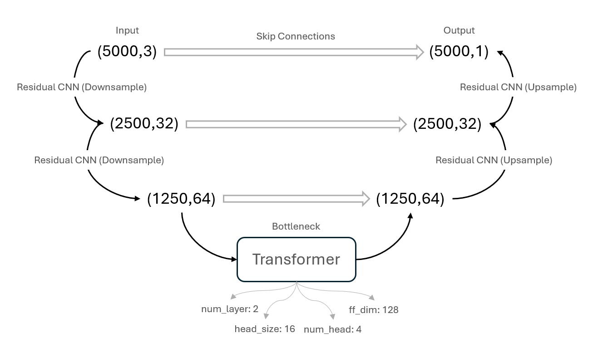

# Restoration of Missing or Low-Quality 12-Lead ECG Signals

This repository contains the MATLAB and Python implementation for restoring missing or low-quality 12-lead ECG signals using an ensemble deep-learning model. The project replicates and enhances the methodology proposed in the [Paper](./paper.pdf) titled *"Restoration of Missing or Low-Quality 12-Lead ECG Signals Using Ensemble Deep-Learning Model with Optimal Combination"*. 

## Overview
Electrocardiograms (ECGs) are widely used for diagnosing cardiac conditions. However, missing or low-quality signals caused by noise or equipment errors can reduce their reliability. This project aims to restore such signals using a hybrid approach combining statistical and deep-learning techniques.

## Features
- Dataset preparation and preprocessing.
- Advanced noise removal techniques (bandpass filtering, wavelet denoising).
- Linear regression to identify optimal lead combinations.
- Deep learning model using a U-Net architecture with a Transformer bottleneck for reconstruction.

## Table of Contents
1. [Abstract](#abstract)
2. [Procedure](#procedure)
3. [Methodology](#methodology)
4. [Results](#results)
5. [How to Use](#how-to-use)
6. [Acknowledgments](#acknowledgments)

## Abstract
The original study addresses challenges in 12-lead ECGs caused by noise and missing signals. This project replicates the methodology, applying additional optimizations such as GPU acceleration, stricter outlier removal, and an improved deep-learning model. The primary goal is to evaluate and enhance the study’s findings.

## Procedure
### Original Algorithm Proposal
The study proposed combining statistical linear regression and deep learning (CNN + Bi-LSTM) to reconstruct missing leads using optimal combinations of three leads.

### Modifications
1. **Dataset**: The original dataset was unavailable, so an alternative was used.
2. **Noise Removal**: Additional preprocessing steps, including wavelet denoising and stricter thresholds.
3. **Model Enhancements**: Replacing Bi-LSTM with a U-Net and Transformer bottleneck, reducing parameters and improving training efficiency.

## Methodology
### Data Preprocessing
1. **Filtering**: Bandpass filtering (0.05–150 Hz) and highpass filtering (cutoff at 0.5 Hz) to remove noise.
2. **Wavelet Denoising**: Daubechies mother wavelets to target ECG-specific noise.
3. **Normalization**: Min-max scaling for improved numerical stability.

### Model Architecture
The deep-learning model employs a U-Net-style encoder-decoder with a Transformer bottleneck:

- **Encoder**: Extracts multi-scale features.
- **Transformer Bottleneck**: Captures global relationships.
- **Decoder**: Reconstructs the target lead.

### Results
- **Training Time**: Reduced from 4 hours to ~20 minutes.
- **Reconstruction Accuracy**: Achieved lower RMSE and higher cosine similarity compared to the original model.

## Results

### Metrics Comparison
| Lead  | Cosine Similarity (Paper) | Cosine Similarity (Ours) | RMSE (Paper) | RMSE (Ours) |
|-------|---------------------------|--------------------------|--------------|-------------|
| Lead I| 0.992                     | 0.991                    | 0.033        | 0.059       |
| ...   | ...                       | ...                      | ...          | ...         |

## How to Use
### Prerequisites
1. MATLAB with required toolboxes:
   - Signal Processing Toolbox
   - Wavelet Toolbox
   - Statistics and Machine Learning Toolbox
2. Python with libraries: `numpy`, `pandas`, `tensorflow`, etc.
3. Download the ECG dataset from [PhysioNet](https://physionet.org/).

### Step-by-Step Instructions
1. **Extract ECG Data**
   - Open and run `Database_Extraction.m` in MATLAB.
   - Set the `root_folder` variable to your dataset path.
2. **Preprocess the Data**
   - Run `Preprocessing.m` to generate preprocessed chunks.
3. **Assess Data Quality**
   - Run `assess_record_quality.m` to filter and classify signals.
4. **Model Training**
   - Use the Python notebook provided to load preprocessed data and train the model.

## Acknowledgments
This project was developed as part of the Biomedical Signal Processing Laboratory (POLIMI 2024-2025) by:
- Jazmín Azul Fermani
- Federico Sangineto Cotrina
- Shahryar Namdari Ghareghani

For more details, refer to the full [Report](./Report.pdf).

---
Feel free to fork, contribute, and share your feedback!
